# CSCI5832_NLP-Shared-task
Repository for NLP Shared task

**Task 6B: LegalEval: Understanding Legal Texts**

Link to the base model repository: [Here](https://github.com/Legal-NLP-EkStep/legal_NER)

**Problem:**

Named Entities Recognition is a frequently researched issue in Natural Language Processing, and there are numerous publicly available pre-trained models. However, when it comes to domain specific entities, in this the case the legal domain, entities like names of petitioner, respondent, court, statute, provision, precedents, etc. are hard to detect using the regular, off the shelf named entity recognizers. Moreover, standard Named Entity Recognizers like spacy do not recognize these entity types. Therefore, it is necessary to create a Legal NER model fine-tuned on legal documents and entities. Up until now, there weren’t any publicly accessible annotated datasets. But now that we have it, it is crucial to create a separate legal NER for texts of Indian court judgments and the fact that these documents are filled with peculiarities of Indian legal processes and terminology makes it a challenging problem to solve.

**How does the data look like and what kind of entities are we trying to extract?**

Some entities are extracted from Preamble of the judgements and some from judgement text. Preamble of judgment contains formatted metadata like names of parties, judges, lawyers, date, court etc. The text following preamble till the end of the judgment is called as the "judgment"

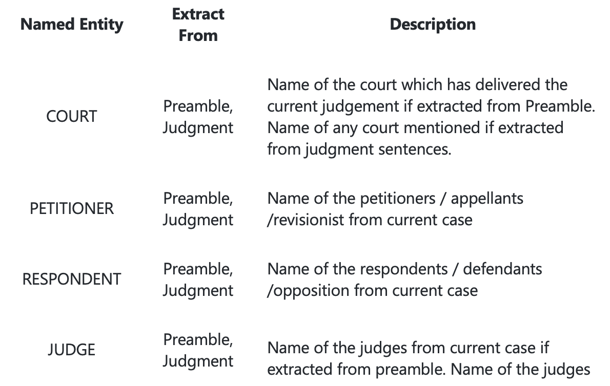
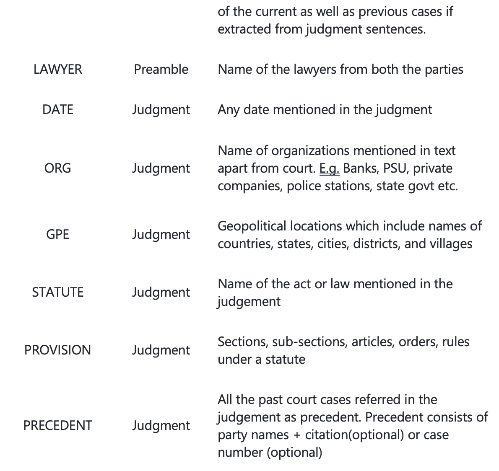
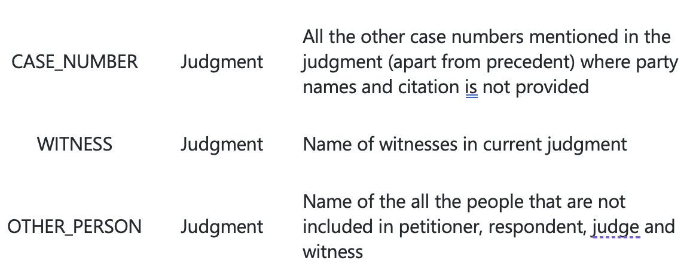

**What is the approach to building custom Named entity Recognizer specific to a domain?**

At its core, entity recognition systems have two steps:
1.	Detecting the entities in text 
2.	Categorizing the entities into named classes

In order to build a custom legal domain named entity recognizer, we plan on employing Spacy.

**Why spaCy?**

SpaCy has a large contribution to the adoption of NLP in the industry as a free, open-source python library. It is designed to handle a large volume of text data and to draw insights by understanding text and it is also suited for production use. It can be used to build Information Extraction(IE) or Natural language understanding(NLU) systems or to pre-process text for deep learning use cases. SpaCy supports tokenization, part of speech(POS) tagging, dependency parsing, and many others NLP tasks. spaCy has pre-trained models for a ton of use cases, for ex. Named Entity Recognition, but based on the domain in which the model is used, it might benefit from re training and fine tuning.

When we use nlp (spacy model object) on some text, spaCy first tokenizes the text to produce a `Doc` object, which is then processed in the next stages in the pipeline. The pipeline used by the default models consists of a tagger stage, a parser stage, and an entity recognizer(ner) stage. Each pipeline component processes the `Doc` object and then passed it on to the next component/stage.

In order to train a custom Named entity recognizer using spaCy we need to do the following:

•	Training Data Preparation(examples with their labels)
•	Conversion of data to .spacy format
•	Create config file in order to train the model
•	Update the config file with required hyper-parameters
•	Run the Training

A model is trained in an iterative process, in which the model’s predictions are compared against the labels(ground truth) in order to compute the gradient of the loss. The gradient of the loss is then used to update the model weights through the backpropagation algorithm. The gradients indicate how much the weight values should be adjusted so that the model’s predictions become more similar or closer to the provided labels over time.

**Training Data Preparation:**

Preprocessing raw Json files, extracting required text, entities and start, end location from list of dictionaries.

**Conversion of data to .spacy format**

To convert data to spacy format, we need to create a DocBin object which will store the data. We will then iterate through our data and add the example and the entity label to the DocBin object and save the object to .spacy file

**Creating a config file**

We can use an easy-to-use widget on the web to create a basic boiler plate base_config file with all the basic parameters prefilled.
On the Config page, we can select `ner` as components and hardware based on system availability, and we can also select to optimize for efficiency or accuracy. All these choices will impact the choice of the architecture, pretrained weights, and the hyperparameters.

Once the ner is chosen the spaCy pipeline will have 'tok2vec' and ‘ner' in it’s pipeline.

**tok2vec**: The tok2vec layer is a machine learning component that learns how to produce suitable (dynamic) vectors for tokens. It does this by looking at lexical attributes of the token but may also include the static vectors of the token. This component is generally not used by itself, but is part of another component, such as an NER. It will be the first layer of the NER model, and it can be trained as part of training the NER, to produce vectors that are suitable for your NER task.

**Why use tok2vec?**

Embedded word representations, also known as “word vectors”, are now one of the most widely used natural language processing technologies. Word embeddings let you treat individual words as related units of meaning, rather than entirely distinct IDs. However, most NLP problems require understanding of longer spans of text, not just individual words. There’s now a simple and flexible solution that is achieving excellent performance on a wide range of problems. After embedding the text into a sequence of vectors, bidirectional RNNs are used to encode the vectors into a sentence matrix. The rows of this matrix can be understood as token vectors — they are sensitive to the sentential context of the token. The final piece of the puzzle is called an attention mechanism. This lets you reduce the sentence matrix down to a sentence vector, ready for prediction. 

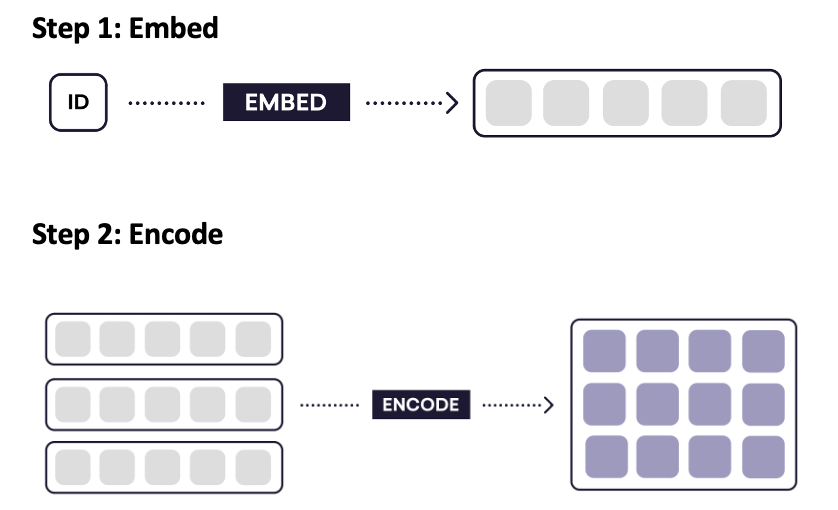
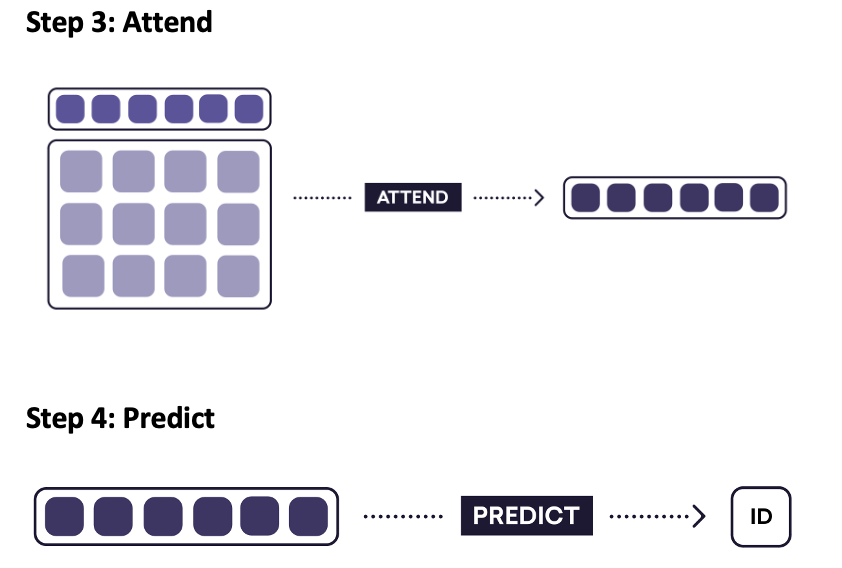

**What is tok2seq component made up of?**

1.	tok2vec model is made up of two subnetworks: one for embedding and one for encoding.
-	**embed**: Embeds tokens into context-independent word vector representations (MultiHashEmbed: embedding layer that uses subword features, and a MaxoutWindowEncoder encoding layer consisting of a CNN and a layer-normalized maxout activation function.)
-	**encode**: encodes context into the embeddings, using an architecture such as a CNN, BiLSTM or transformer (MaxoutWindowEncoder)

Finally, hyper parameters can be tuned in order to improve the performance

**How does the custom ner perform?**

**1st Approach:**

- Read in judgement and preamble training data from 2 different json files
- Combine judgement and preamble data and extract relevant data from the list of dictionaries: text, entities, start and end location of entities in the text.
- Split data into train and dev set(0.8 split)
- Convert both the datasets into DocBin spaCy objects
- Train and Evaluate the Best model

**Observation**: the best score for model trained this way was around 0.60

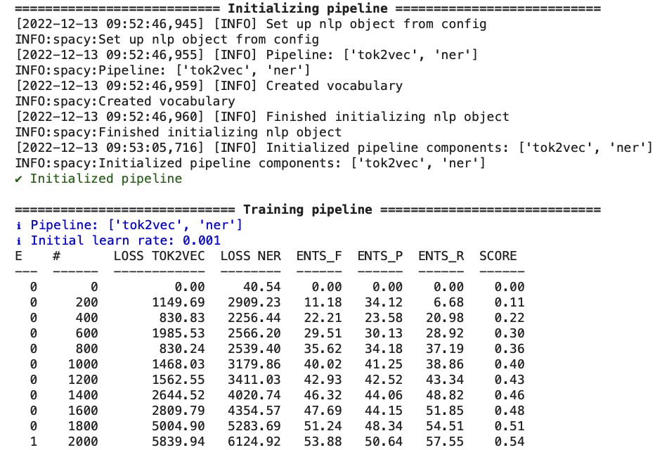
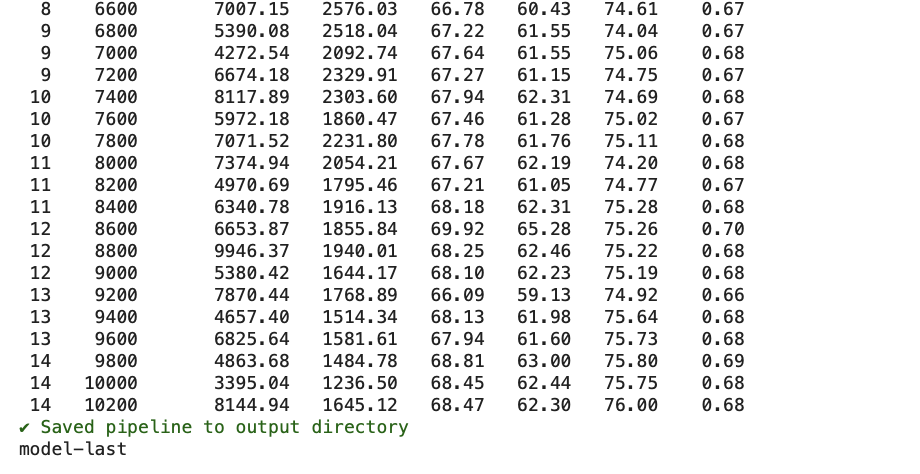

**2nd Approach:**

- Read in judgement and preamble training data from 2 different json files
- Individually extract relevant data from the list of dictionaries: text, entities, start and end location of entities in the text from judgement and preamble datasets
- Individually Split data into train and dev set(0.8 split)
- Combine judgement and preamble data(train + dev) to create a combined train and dev set
- Convert both (train, dev) datasets into DocBin spaCy objects
- Train and Evaluate the Best model

**Observation**: This way the trained model performs much better with F score around 0.90

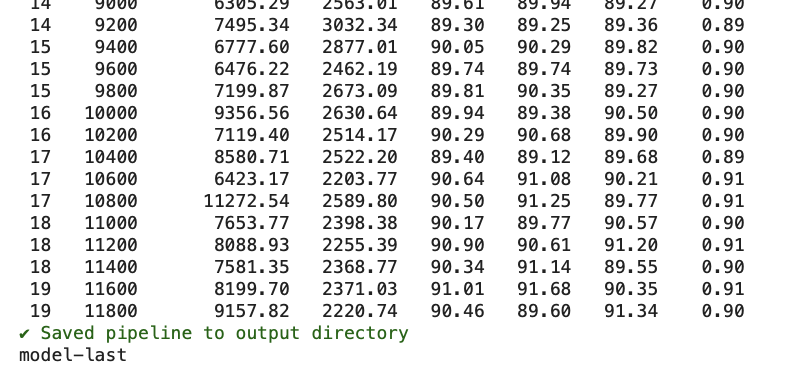

**Metrics from spaCy Evaulation pipeline**

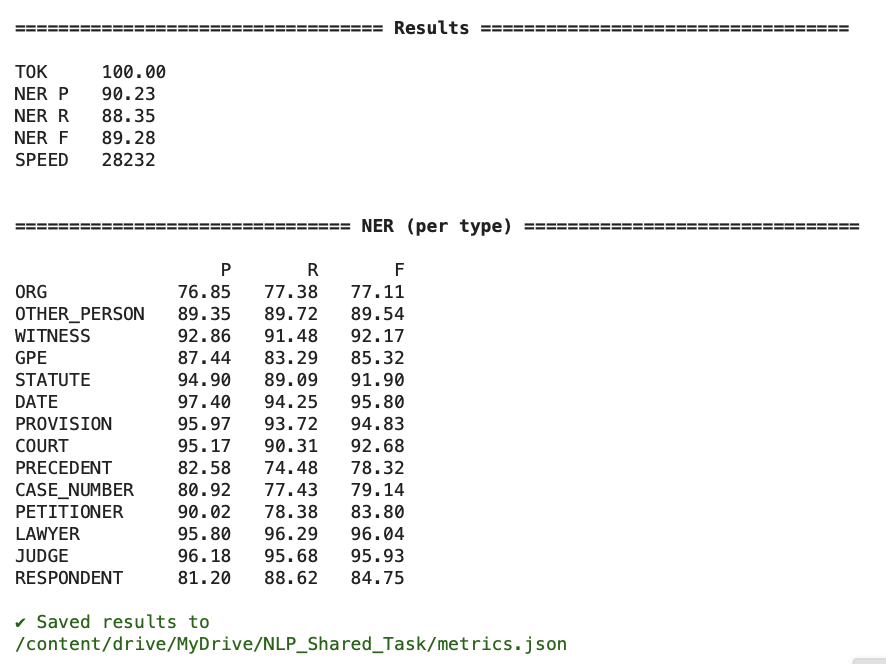

**Custom Legal NER in Action**

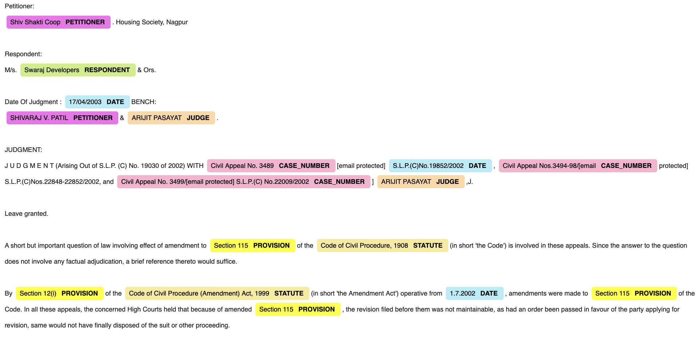

**Confusion matrix of model performance**

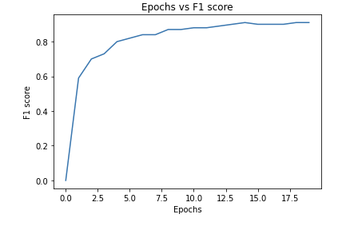

